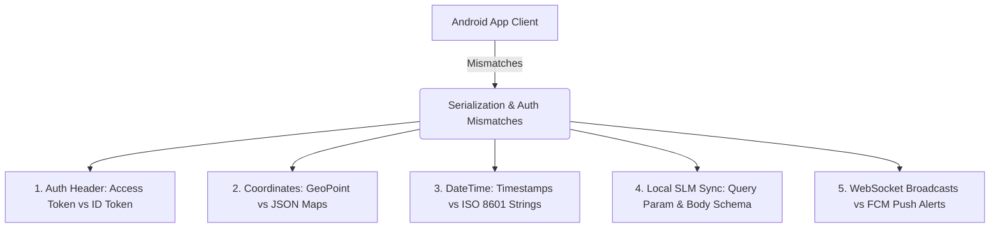

# BimariHaunter: Android-to-Backend Architectural Alignment & Troubleshooting Specification

This document provides a highly technical, comprehensive specification outlining the exact architectural contracts, models, schemas, and processing flows of the **BimariHaunter** backend. Use this guide to resolve all communication, schema, and serialization mismatches between the Android native Kotlin app and the FastAPI/Firestore backend.

---

## 1. Root Causes of Architectural Mismatches

If your Android client is crashing, failing to parse network payloads, or returning `401 Unauthorized` / `400 Bad Request` from the backend, it is due to one of five architectural mismatches. Ensure you align your client code to these specific patterns:



### 1.1 Auth Header: Access Tokens vs Firebase ID Tokens
* **Mismatch**: The Android app often requests `user.accessToken` (a short-lived token meant for client SDK handshakes) or standard OAuth access tokens.
* **Alignment**: The FastAPI backend uses Firebase Admin SDK's JWT decoder (`verify_firebase_token`) which **strictly requires the Firebase ID Token (ID JWT)**.
* **Resolution**: Acquire the token on Android using `getIdToken(forceRefresh = true)` and append it as a Bearer credential:
  `Authorization: Bearer <Firebase_ID_Token>`

### 1.2 Coordinate Formats: GeoPoint Objects vs JSON Maps
* **Mismatch**: Inside Firestore, the coordinates are stored as a Native Firestore `GeoPoint` class. If the Android app attempts to deserialize the `/feed` REST JSON into a GeoPoint object directly, parsing fails.
* **Alignment**: The backend converts coordinates into serializable JSON structures.
  * **Direct Firestore SDK**: `/users/{userId}` uses Native `GeoPoint(latitude, longitude)`.
  * **REST API HTTP**: `/api/v1/feed` serializes coordinates into standard JSON maps:
    ```json
    "coordinates": { "latitude": 24.8607, "longitude": 67.0011 }
    ```

### 1.3 DateTime Formats: Timestamps vs ISO 8601 Strings
* **Mismatch**: Firestore databases store dates as Firestore `Timestamp` objects (nanoseconds/seconds). However, when fetched via backend HTTP endpoints, they are serialized to standardized strings.
* **Alignment**: Android Room and network models must parse dates as ISO 8601 string representations (e.g. `2026-05-20T02:45:00.662161` or `2026-05-20T02:45:00Z`).

### 1.4 Local SLM Synchronization: Route Parameters & Schema requirements
* **Mismatch**: The endpoint `/api/v1/chats/{chatId}/messages` has two operating modes: `smart` (Server-side Gemini tool calling) and `local` (Sync offline client SLM logs).
* **Alignment**: 
  * If `mode=smart` (default), the JSON body requires ONLY the user's `text`.
  * If `mode=local`, the JSON body **MUST** include `local_slm_response`. Failing to pass this parameter when `mode=local` will trigger a `400 Bad Request`.
* **Mobile SLM Deployment**: To implement a lightweight, ultra-small (350MB - 750MB) local model instead of a heavy 4GB file, follow the [Mobile SLM Integration & Optimization Guide](file:///c:/Users/S-Z%20Computers/bimarihaunter-backend/docs/mobile_slm_integration.md).

### 1.5 WebSocket Broadcasts vs FCM Push Alerts
* **Mismatch**: The app receives real-time messages via active WebSockets when open, but loses updates when closed/backgrounded.
* **Alignment**: WebSockets are only for foreground active feeds (`/ws/{device_id}`). Firebase Cloud Messaging (FCM) is used to send push alerts when the app is closed or backgrounded.

---

## 2. API Contract & JSON Payload Specifications

### 2.1 Update Location & Sync Feed
* **Route**: `POST /api/v1/users/location`
* **Purpose**: Registers the user's live city and coordinates on Firestore. Immediately pulls the 50 most recent local outbreak reports, trims the user's personal feed using a **FIFO stack**, and caches them in the user's personal Firestore subcollection `/users/{userId}/feed`.
* **Headers**: `Authorization: Bearer <ID_Token>`
* **Request Body** (`application/json`):
```json
{
  "city": "Karachi",
  "latitude": 24.8607,
  "longitude": 67.0011
}
```
* **Response Body** (`200 OK`):
```json
{
  "status": "success",
  "message": "Successfully updated location to Karachi and synchronized 50 local feed posts.",
  "city": "Karachi",
  "feed_count": 50
}
```

### 2.2 Get Personalized Outbreak Feed
* **Route**: `GET /api/v1/feed`
* **Purpose**: Retrieves up to 50 localized reports for the user's city. If the personal feed is empty or the location is not set, the endpoint dynamically falls back to the **global** outbreaks collection.
* **Headers**: `Authorization: Bearer <ID_Token>`
* **Query Parameters**: `limit=50`
* **Response Body** (`200 OK`):
```json
[
  {
    "id": "sha256_deterministic_article_hash",
    "title": "Dengue outbreak surge in Gulshan area",
    "source": "Dawn News",
    "url": "https://dawn.com/article/dengue-karachi",
    "raw_text": "A massive surge in dengue cases has been reported by district officers...",
    "published_at": "2026-05-20T02:45:00Z",
    "scraped_at": "2026-05-20T03:00:00Z",
    "status": "analyzed",
    "source_type": "web",
    "ai_analysis": {
      "disease": "dengue",
      "severity": "high",
      "summary": [
        "Gulshan-e-Iqbal has reported 15 new dengue hospitalizations.",
        "Municipal authorities advise immediate mosquito net controls."
      ],
      "symptoms": ["fever", "joint pain", "headache"],
      "locations": ["Karachi", "Gulshan"],
      "coordinates": {
        "latitude": 24.8922,
        "longitude": 67.0747
      },
      "confidence_score": 0.94,
      "model_used": "facebook/bart-large-mnli"
    }
  }
]
```

### 2.3 Send Chat Message (Local SLM Sync vs Smart Gemini Agent)
* **Route**: `POST /api/v1/chats/{chatId}/messages`
* **Query Parameter**: `mode` (string: `local` or `smart`. Default: `local`)
* **Headers**: `Authorization: Bearer <ID_Token>`

#### Scenario A: mode=local (Sync on-device SLM chat history)
Use this to backup conversation threads that occurred while the user was offline and generating local, on-device responses.
* **Request Body** (`application/json`):
```json
{
  "text": "Are there active dengue cases in Karachi?",
  "local_slm_response": "Yes. According to your local feed, Dengue cases are highly active in Karachi, especially in Gulshan. Symptoms include fever and joint pain."
}
```
* **Response Body** (`200 OK`):
```json
{
  "status": "success",
  "mode": "local",
  "user_message_id": "doc_user_msg_xyz",
  "ai_message_id": "doc_ai_msg_xyz",
  "response": "Yes. According to your local feed, Dengue cases are highly active in Karachi..."
}
```

#### Scenario B: mode=smart (Invoke Cloud-Side Gemini Agentic RAG)
Use this when the user is online and toggles to "Smart Mode." The backend calls Gemini, executing tools like Firestore search and live web crawls.
* **Request Body** (`application/json`):
```json
{
  "text": "What is the absolute latest breaking dengue outbreak in Clifton Karachi?"
}
```
* **Response Body** (`200 OK`):
```json
{
  "status": "success",
  "mode": "smart",
  "user_message_id": "doc_user_msg_abc",
  "ai_message_id": "doc_ai_msg_abc",
  "response": "According to the latest verified data and a live search, Karachi South (Clifton) has reported vector treatment campaigns near block 5. Precautions include clearing standing water."
}
```

---

## 3. Kotlin Client-Side Implementation Guidelines

To prevent crashes and align with our dual-mode offline design, implement the following architectural features inside the Android codebase:

### 3.1 Firebase Token Interceptor
Do not pass the simple user token. Build a network interceptor that requests the active Firebase JWT ID Token:

```kotlin
import okhttp3.Interceptor
import okhttp3.Response
import com.google.firebase.auth.FirebaseAuth
import kotlinx.coroutines.tasks.await
import kotlinx.coroutines.runBlocking

class FirebaseAuthInterceptor : Interceptor {
    override fun intercept(chain: Interceptor.Chain): Response {
        val user = FirebaseAuth.getInstance().currentUser
        
        // Block thread synchronously to acquire fresh Firebase ID Token (JWT)
        val token = if (user != null) {
            try {
                runBlocking {
                    user.getIdToken(true).await().token
                }
            } catch (e: Exception) {
                null
            }
        } else null

        val newRequest = chain.request().newBuilder().apply {
            if (token != null) {
                addHeader("Authorization", "Bearer $token")
            }
        }.build()

        return chain.proceed(newRequest)
    }
}
```

### 3.2 SQLite Room Caching & Type Converters
To support offline RAG, the feed must be cached locally inside a SQLite Room database. Use a custom `TypeConverter` to serialize coordinate maps and summary list arrays to avoid database creation crashes:

```kotlin
import androidx.room.Entity
import androidx.room.PrimaryKey
import androidx.room.TypeConverter
import com.google.gson.Gson
import com.google.gson.reflect.TypeToken

@Entity(tableName = "outbreak_reports")
data class OutbreakReport(
    @PrimaryKey val id: String,
    val title: String,
    val source: String,
    val url: String?,
    val raw_text: String?,
    val published_at: String,
    val scraped_at: String,
    val source_type: String,
    val disease: String?,
    val severity: String?,
    val summary: List<String>?,
    val symptoms: List<String>?,
    val locations: List<String>?,
    val latitude: Double?,
    val longitude: Double?,
    val confidence_score: Double?
)

class OutbreakConverters {
    private val gson = Gson()

    @TypeConverter
    fun fromStringList(value: List<String>?): String? = gson.toJson(value)

    @TypeConverter
    fun toStringList(value: String?): List<String>? {
        val listType = object : TypeToken<List<String>?>() {}.type
        return gson.fromJson(value, listType)
    }
}
```

### 3.3 Client-Side Offline SLM Prompt Construction (RAG)
When the user is offline (or in Local Mode), compile the local Room reports to construct a private, context-based prompt for the on-device SLM model (e.g. MediaPipe LLM Inference running LLaMA/Gemma):

```kotlin
fun compileOfflinePrompt(userQuery: String, cachedReports: List<OutbreakReport>): String {
    val contextBuilder = StringBuilder()
    
    // Extract the top 10 relevant items from our 50-post local stack
    cachedReports.take(10).forEach { report ->
        val severity = report.severity?.uppercase() ?: "MEDIUM"
        val bulletPoints = report.summary?.joinToString("; ") ?: ""
        contextBuilder.append("- [${report.source}] ${report.title} (Severity: $severity). Summary: $bulletPoints\n")
    }

    return """
        System: You are BimariHaunter Local SLM, a lightweight on-device medical outbreak advisor. 
        Speak ONLY using the localized context below. Do not make up facts.
        
        Context:
        ${contextBuilder.toString()}
        
        User Query: $userQuery
        
        AI Response:
    """.trimIndent()
}
```

### 3.4 Google Maps Markers Severity Rendering
When plotting feed coordinates onto the map, style markers dynamically based on the severity returned in the `/feed` JSON:

```kotlin
import com.google.android.gms.maps.model.BitmapDescriptorFactory
import com.google.android.gms.maps.model.LatLng
import com.google.android.gms.maps.model.MarkerOptions

fun getMarkerOptions(report: OutbreakReport): MarkerOptions {
    val latLng = LatLng(report.latitude ?: 0.0, report.longitude ?: 0.0)
    
    val hue = when (report.severity?.lowercase()) {
        "high" -> BitmapDescriptorFactory.HUE_RED        // High outbreak alert
        "medium" -> BitmapDescriptorFactory.HUE_ORANGE   // Medium outbreak warning
        "low" -> BitmapDescriptorFactory.HUE_GREEN       // Low severity / general news
        else -> BitmapDescriptorFactory.HUE_YELLOW
    }

    return MarkerOptions()
        .position(latLng)
        .title(report.title)
        .snippet(report.disease ?: "Outbreak Warning")
        .icon(BitmapDescriptorFactory.defaultMarker(hue))
}
```

### 3.5 WebSocket Broadcast Operations
If the Android client wants to listen for real-time broadcasts when online, establish a WebSocket connection to `wss://<HOST>/ws/{device_id}`:
1. **Subscription Registration**: Upon connection, send a subscription frame to configure preferences:
   ```json
   {
     "action": "subscribe",
     "preferences": {
       "alert_radius_km": 10.0,
       "monitored_diseases": ["dengue", "malaria"]
     }
   }
   ```
2. **Heartbeat Maintenance**: Send a ping every 30 seconds to maintain connection:
   ```json
   { "action": "heartbeat" }
   ```
   *Expected Server Response*: `{ "action": "pong" }`
3. **Receipt Acknowledgement**: When receiving a V1 Insight frame, ack by sending:
   ```json
   {
     "action": "mark_read",
     "report_id": 123,
     "version": "v1"
   }
   ```

---

## 4. Troubleshooting Checklist for Android Developers

* `[ ]` **HTTP 401 Unauthorized**: Check if your OkHttpClient is appending the `idToken` (from `FirebaseAuth.getInstance().currentUser?.getIdToken(true)`) as `Bearer <token>` in the `Authorization` header. Do NOT append `accessToken`.
* `[ ]` **HTTP 400 Bad Request on /messages**: Check if the request body is missing the parameter `local_slm_response` when querying with parameter `mode=local`.
* `[ ]` **Room DB Migration/Compile Crashing**: Verify that you registered `OutbreakConverters` inside your `@Database` implementation to allow Gson serialization of arrays/coordinates.
* `[ ]` **Firestore Query Error 400 (Requires Index)**: If the backend returns a composite index warning, ensure the links provided in **Section 3.1 of the Checklist** have been clicked to initialize database indices in your Firestore Console.
* `[ ]` **Coordinates Parsing Error**: Verify that your deserializer maps `ai_analysis.coordinates` as a nested JSON object `{"latitude": Double, "longitude": Double}` rather than trying to parse it as an SDK `GeoPoint` class.
