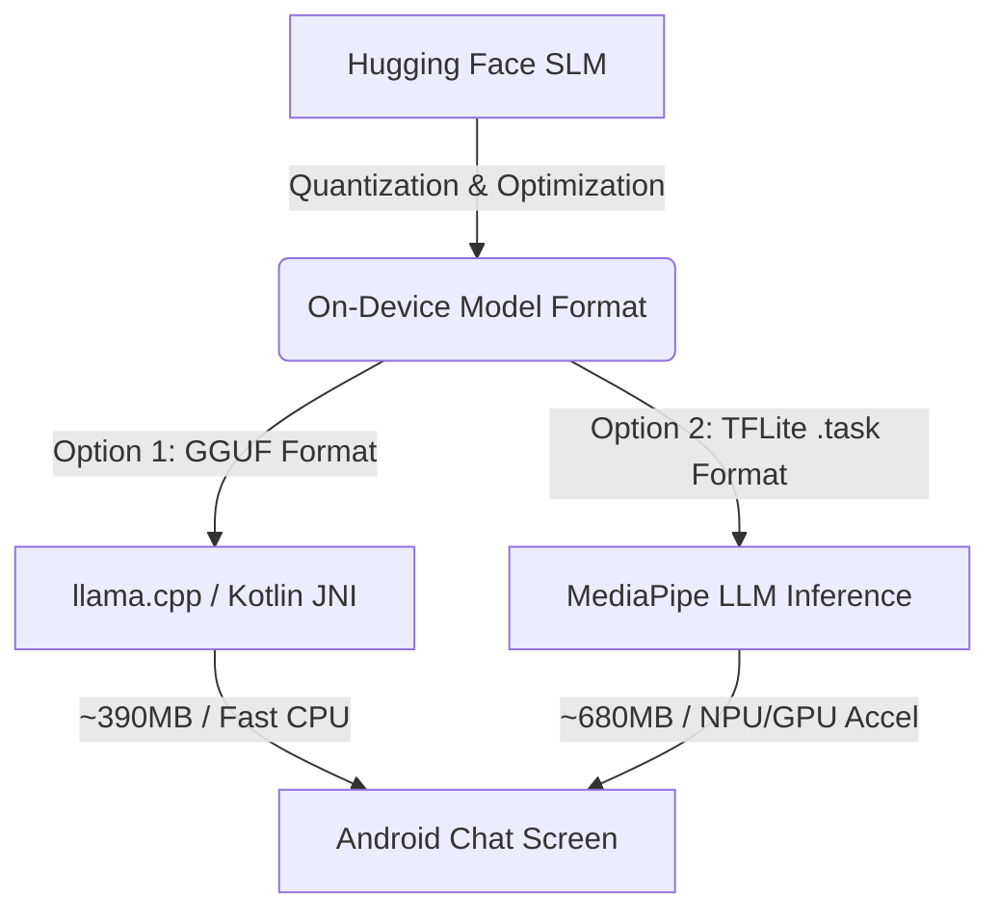

# BimariHaunter: On-Device Mobile SLM Integration & Optimization Guide

This guide provides a comprehensive, step-by-step specification for deploying **highly optimized, extremely lightweight Small Language Models (SLMs)** on native Android devices. 

By following this guide, you will replace massive 4 GB+ model files with high-performance, 4-bit/8-bit quantized models ranging from **350 MB to 750 MB**, allowing seamless, offline, on-device AI chat within the 1-2 GB mobile RAM boundary.

---



---

## 1. Optimal Lightweight SLMs for Mobile Devices

For standard mobile devices, you should target models **under 2 Billion parameters**, quantized to **4-bit integer formats (INT4)**. This reduces file sizes by **75% to 85%** and drastically lowers memory bandwidth limits, enabling fast token generation on mid-range mobile CPUs/GPUs.

### Recommended Models & Resource Metrics

| Model Name | Parameters | Hugging Face Hub Path | GGUF Quantization | Quantized File Size | Min. Device RAM |
| :--- | :---: | :--- | :---: | :---: | :---: |
| **Qwen 2.5 0.5B Instruct** | 490M | `Qwen/Qwen2.5-0.5B-Instruct` | `Q4_K_M` | **~397 MB** | 1.5 GB |
| **Llama 3.2 1B Instruct** | 1.23B | `meta-llama/Llama-3.2-1B-Instruct` | `Q4_K_M` | **~740 MB** | 2.0 GB |
| **Gemma 2 2B IT** | 2.6B | `google/gemma-2-2b-it` | `Q4_K_M` | **~1.60 GB** | 4.0 GB |
| **Phi 3.5 Mini Instruct** | 3.82B | `microsoft/Phi-3.5-mini-instruct` | `Q4_K_M` | **~2.20 GB** | 6.0 GB |

> [!TIP]
> **Our Recommendation**: Use **Qwen 2.5 0.5B Instruct** for absolute maximum compatibility and lightning-fast execution on older phones, or **Llama 3.2 1B Instruct** for state-of-the-art medical query reasoning at a very reasonable ~740 MB size.

---

## 2. Option A: Zero-Compilation Pre-Quantized GGUF (llama.cpp)
**Best for**: Speed of implementation, custom models, and ultra-low storage footprints.

Hugging Face hosts community-made pre-quantized versions of these models in **GGUF format**. By using GGUF and `llama.cpp` Android bindings, you do not need to perform any quantization on your own machine.

### Step 2.1: Download the Model from Hugging Face
To download the optimized Llama 3.2 1B or Qwen 2.5 0.5B model directly:

* **Llama 3.2 1B Instruct (GGUF)**:
  Download the `Llama-3.2-1B-Instruct-Q4_K_M.gguf` file from:
  [huggingface.co/bartowski/Llama-3.2-1B-Instruct-GGUF](https://huggingface.co/bartowski/Llama-3.2-1B-Instruct-GGUF/tree/main)
* **Qwen 2.5 0.5B Instruct (GGUF)**:
  Download the `Qwen2.5-0.5B-Instruct-Q4_K_M.gguf` file from:
  [huggingface.co/Qwen/Qwen2.5-0.5B-Instruct-GGUF](https://huggingface.co/Qwen/Qwen2.5-0.5B-Instruct-GGUF/tree/main)

### Step 2.2: Add llama.cpp to Android Studio
1. In your `app/build.gradle.kts`, add the official `llama.cpp` library wrapper dependency (or compile via CMake/NDK):
   ```kotlin
   dependencies {
       implementation("com.github.ggerganov:llama.cpp:master-SNAPSHOT") // Or local NDK bindings
   }
   ```
2. Place the downloaded `.gguf` file in the device's external storage `/sdcard/Download/` folder, or pack it in the `assets/` directory (note: assets have a 2GB limit, which our optimized models easily bypass).

### Step 2.3: Kotlin Execution Interface
Implement a simple service in Kotlin to load the GGUF model and stream inferences:

```kotlin
import class com.ggerganov.llama.LlamaModel
import class com.ggerganov.llama.LlamaContext

class LocalSLMManager(private val modelPath: String) {
    private var model: LlamaModel? = null
    private var context: LlamaContext? = null

    init {
        // Load the quantized GGUF model into memory
        model = LlamaModel.loadFromFile(modelPath)
        context = model?.createContext()
    }

    fun generateAnswer(prompt: String, onTokenGenerated: (String) -> Unit): String {
        val result = StringBuilder()
        context?.let { ctx ->
            ctx.evalPrompt(prompt) { token ->
                result.append(token)
                onTokenGenerated(token)
            }
        }
        return result.toString()
    }

    fun close() {
        context?.release()
        model?.release()
    }
}
```

---

## 3. Option B: MediaPipe LLM Inference API (TFLite .task)
**Best for**: Hardware acceleration (NPU and GPU), smooth animations, and official Google Support on Android.

MediaPipe allows you to run quantized models with NPU/GPU acceleration, resulting in extremely high token throughput.

### Step 3.1: Python Quantization & Conversion
To run an SLM in MediaPipe, you must convert the Hugging Face weights into a Flatbuffer `.task` file using MediaPipe's Python converter.

1. **Install Conversion Requirements**:
   ```bash
   pip install mediapipe huggingface_hub torch tf-keras
   ```
2. **Download Model from Hugging Face**:
   ```python
   from huggingface_hub import snapshot_download

   # Download the raw Llama-3.2-1B-Instruct model
   model_dir = snapshot_download(
       repo_id="meta-llama/Llama-3.2-1B-Instruct",
       local_dir="./llama_raw"
   )
   ```
3. **Execute MediaPipe Quantization script (INT4)**:
   Run the converter to quantize the model weights to 4-bit and save them as a single `.task` file:
   ```bash
   python -m mediapipe.tasks.python.genai.converter \
       --input_ckpt_type=LLAMA_3_2 \
       --input_ckpt_path=./llama_raw \
       --output_dir=./llama_optimized \
       --backend=cpu
   ```
   *This outputs `llama_optimized/llm_model.task` which is only **~680 MB**.*

> [!IMPORTANT]
> The `--backend=cpu` option optimizes execution for mobile CPUs and keeps the weights compatible with mobile NPU/GPU structures. If you target mobile GPUs explicitly, set `--backend=gpu`.

### Step 3.2: Android SDK Setup
1. Add the MediaPipe tasks dependency to your Android `app/build.gradle.kts`:
   ```kotlin
   dependencies {
       implementation("com.google.mediapipe:tasks-genai:0.10.14")
   }
   ```
2. Copy the outputted `llm_model.task` (680 MB) onto the Android emulator or physical device.

### Step 3.3: Kotlin Integration Code
Create a helper to load the task file and stream chat outputs:

```kotlin
import com.google.mediapipe.tasks.genai.llminference.LlmInference
import com.google.mediapipe.tasks.genai.llminference.LlmInference.LlmInferenceOptions

class MediaPipeSLMHelper(private val context: Context, private val modelPath: String) {
    private var llmInference: LlmInference? = null

    init {
        val options = LlmInferenceOptions.builder()
            .setModelFilePath(modelPath)
            .setMaxTokens(512)
            .setTemperature(0.7f)
            .setTopK(40)
            .build()
        
        llmInference = LlmInference.createFromOptions(context, options)
    }

    /**
     * Executes synchronous generation (blocking thread).
     */
    fun generateResponse(compiledPrompt: String): String {
        return llmInference?.generateResponse(compiledPrompt) ?: "Error initializing local SLM"
    }

    /**
     * Executes asynchronous generation with token streaming for real-time UI updates.
     */
    fun generateResponseAsync(compiledPrompt: String, onResult: (String, Boolean) -> Unit) {
        llmInference?.generateResponseAsync(compiledPrompt) { partialResult, done ->
            onResult(partialResult, done)
        }
    }

    fun close() {
        llmInference?.close()
    }
}
```

---

## 4. Prompt Engineering for Mobile SLMs (RAG Layout)

Lightweight SLMs (especially 0.5B and 1B parameters) have smaller context windows and are more prone to hallucination than massive cloud models. You must format your prompts **strictly** to prevent the model from drifting.

### Highly Recommended System Prompt Template:
When executing a chat message in **Local Mode**, pull the top 5 localized reports from the Room Database, join them, and pass them exactly as shown:

```kotlin
fun formatSLMPrompt(userQuery: String, cachedReports: List<OutbreakReport>): String {
    val contextText = cachedReports.take(5).joinToString("\n") { report ->
        "- [${report.source}] ${report.title}. Location: ${report.locations?.firstOrNull() ?: "Unknown"}. Severity: ${report.severity?.uppercase()}. Summary: ${report.summary?.joinToString("; ") ?: ""}"
    }

    // Strict prompt schema telling the model not to assume or guess
    return """
    <|system|>
    You are BimariHaunter Local SLM. You are a helpful offline health advisor.
    Speak ONLY using the localized context below. If the answer is not in the context, say "I do not have access to that information offline."
    DO NOT make up details or statistics. Keep your answers brief, safe, and actionable.
    
    Context:
    $contextText
    
    User Query:
    $userQuery
    
    <|assistant|>
    """.trimIndent()
}
```

---

## 5. Summary Checklist for Android Devs (Deployment Steps)

1. **[ ] Select Your Model Size**: Pick `Qwen2.5-0.5B-Instruct` (fastest, 397 MB) or `Llama-3.2-1B-Instruct` (smartest, 740 MB).
2. **[ ] Select Deployment Strategy**: 
   * Choose **Option A (llama.cpp)** if you want to download a pre-quantized `.gguf` file instantly.
   * Choose **Option B (MediaPipe)** if you want native hardware acceleration and official Android UI integrations.
3. **[ ] Implement Local Room DB Sync**: Keep the Android Room database synced with `GET /api/v1/feed` so the RAG context is fresh.
4. **[ ] Sync Chat logs**: After completing local generation, enqueue the request to `POST /api/v1/chats/{chatId}/messages?mode=local` passing both `text` and `local_slm_response` to sync histories securely.
