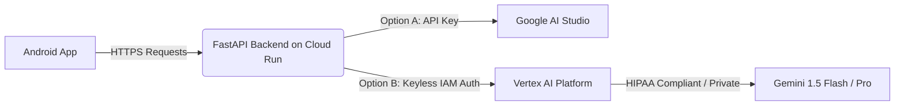

# BimariHaunter: Vertex AI Evaluation & Migration Blueprint

This document details **Google Cloud Vertex AI**, evaluates its suitability for the **BimariHaunter** backend, compares it with Google AI Studio (`google-generativeai`), and provides a step-by-step implementation blueprint to migrate our **Smart Mode** agentic workflows to secure, keyless GCP infrastructures.

---



---

## 1. What is Vertex AI?

**Vertex AI** is Google Cloud Platform's (GCP) enterprise-grade, fully managed machine learning platform. Instead of just offering raw model API access, Vertex AI provides an end-to-end suite for:
*   **Foundation Models (Model Garden)**: Direct API access to Google's state-of-the-art LLMs (Gemini 1.5 Pro, Gemini 1.5 Flash), multimodal models (Imagen, Chirp), and open-source models (Llama 3, Gemma, Mistral).
*   **Keyless Security (IAM)**: Integration with GCP Identity and Access Management (IAM), removing the need for fragile API keys.
*   **Data Governance & Compliance**: Guaranteed data privacy (your prompts/data are **never** used to train public models), regional processing boundaries, and HIPAA compliance readiness.
*   **Enterprise Tooling**: Managed Vector Search, Feature Store, custom model training pipelines, and comprehensive billing/concurrency management.

---

## 2. Vertex AI vs. Google AI Studio (Gemini API)

| Feature | Google AI Studio (`google-generativeai`) | GCP Vertex AI (`google-cloud-aiplatform`) |
| :--- | :--- | :--- |
| **Primary Target** | Prototyping, hobbyists, quick experiments. | Enterprise production apps, secure corporate cloud suites. |
| **Authentication** | Direct, raw `GEMINI_API_KEY` string. | **Keyless IAM OAuth 2.0** (Service Accounts / IAM Roles). |
| **Data Privacy** | In free tier, Google may review prompts/responses. | **Guaranteed private**. No user data is used for model training. |
| **Security Audits** | No native logging or audit trail. | Integrated with Cloud Logging and Cloud Audit Logs. |
| **Regional Controls**| Multi-region, dynamically routed. | Strict regional hosting (e.g. `us-central1`, `asia-east1`). |
| **Rate Limits** | Shared rate limits (low/medium tiers). | Dedicated quotas, custom limits, enterprise SLAs. |

---

## 3. Can We Use Vertex AI in BimariHaunter?

**Yes, and we highly recommend it for the production cloud deployment!**

Because the BimariHaunter backend is built with FastAPI, runs inside **Google Cloud Run**, and stores its records in **Firestore**, moving to Vertex AI offers major architectural upgrades:

1.  **Eliminates Secret API Keys**: By enabling Vertex AI on GCP, Cloud Run can communicate with Gemini using its local Service Account. You can delete `GEMINI_API_KEY` from your environment variables entirely!
2.  **Medical Data Security**: Since BimariHaunter processes geographic disease outbreak logs and health inquiries, keeping user data secure is paramount. Vertex AI ensures that no outbreak context or user chat history is leaked or utilized for training Google's public models.
3.  **Advanced Model Features**: Access to `gemini-1.5-flash` or `gemini-1.5-pro` via Vertex AI brings 1 million+ token context windows, allowing much larger history injections during Smart RAG sessions.

---

## 4. Step-by-Step Vertex AI Migration Blueprint

To transition from Google AI Studio to Vertex AI, execute the following steps:

### Step 4.1: Enable the Vertex AI API on Google Cloud
Propose running the following command on GCP (or execute via the Cloud Console):
```bash
gcloud services enable aiplatform.googleapis.com --project=bimarihaunter-backend
```

### Step 4.2: Grant IAM Roles to the Cloud Run Service Account
Assign the Vertex AI User role to the service account running your FastAPI container:
```bash
gcloud projects add-iam-policy-binding bimarihaunter-backend \
    --member="serviceAccount:bimarihaunter-cloudrun-fbsvc@bimarihaunter-backend.iam.gserviceaccount.com" \
    --role="roles/aiplatform.user"
```

### Step 4.3: Install the Vertex AI SDK
Add the official Google Cloud AI Platform package to `requirements.txt`:
```text
google-cloud-aiplatform>=1.60.0
```

---

## 5. Production-Ready Python Code (Chats Route Migration)

Here is how to refactor your current `app/api/routes/chats.py` endpoint to use **Vertex AI** for agentic tool calling (Firestore Outbreak query and Web Search) with **keyless IAM authentication**.

```python
import os
from fastapi import APIRouter, Depends, HTTPException
import vertexai
from vertexai.generative_models import GenerativeModel, Tool, FunctionDeclaration

# Initialize Vertex AI globally (run on startup)
# When running on Cloud Run, it automatically detects project and location
vertexai.init(
    project=os.environ.get("GCP_PROJECT", "bimarihaunter-backend"),
    location=os.environ.get("GCP_LOCATION", "us-central1")
)

# Define our tools using Vertex AI Schema interfaces
query_outbreaks_declaration = FunctionDeclaration(
    name="query_outbreaks",
    description="Check verified outbreak reports inside our Firestore database for a specific city.",
    parameters={
        "type": "OBJECT",
        "properties": {
            "city": {"type": "STRING", "description": "The name of the city, e.g., Karachi, Lahore"}
        },
        "required": ["city"]
    }
)

query_web_search_declaration = FunctionDeclaration(
    name="query_web_search",
    description="Run a live web search to fetch breaking news and active outbreak articles.",
    parameters={
        "type": "OBJECT",
        "properties": {
            "query_str": {"type": "STRING", "description": "Specific search query text"}
        },
        "required": ["query_str"]
    }
)

# Package declarations as dynamic tools
outbreak_tools = Tool(
    function_declarations=[
        query_outbreaks_declaration,
        query_web_search_declaration
    ]
)

# Load Vertex AI Generative Model (Gemini 1.5 Flash is highly recommended for speed and low cost)
vertex_gemini_model = GenerativeModel(
    model_name="gemini-1.5-flash",
    tools=[outbreak_tools],
    system_instruction=(
        "You are the BimariHaunter AI Outbreak Intelligence Agent, a professional medical advisor "
        "and disease prevention expert in Pakistan. Always prioritize checked reports. Provide precise, "
        "actionable advice. Keep your tone empathetic and clear."
    )
)

def run_vertex_smart_chat(prompt: str) -> str:
    """
    Initializes a vertex chat session with automatic tool/function resolution.
    Runs on GCP using the Cloud Run container's local Service Account.
    """
    # Create chat session
    chat = vertex_gemini_model.start_chat()
    
    # Send message and resolve tools (handles function calling dynamically)
    response = chat.send_message(prompt)
    
    # If the model requested a tool call, execute it and send the results back
    # Note: Vertex AI can handle automatic function calling, or you can loop
    # through response.candidates[0].function_calls if doing manual routing.
    return response.text
```

---

## 6. Checklist: Should We Do This Now?

*   **Offline SLM Mode (Local Mode)**: **No change**. Vertex AI is cloud-only and cannot help the phone run offline. Keep using our optimized **Qwen 2.5 0.5B** or **Llama 3.2 1B** pre-quantized GGUFs for native Android execution.
*   **Smart Mode Sandbox (Local Dev)**: **Optional**. If you are developing locally, standard Google AI Studio with `GEMINI_API_KEY` is faster to test with.
*   **Production Deployment (GCP Cloud Run)**: **Highly Recommended**. Moving to Vertex AI ensures enterprise data security, eliminates secret keys, and aligns with standard Google Cloud best practices.
